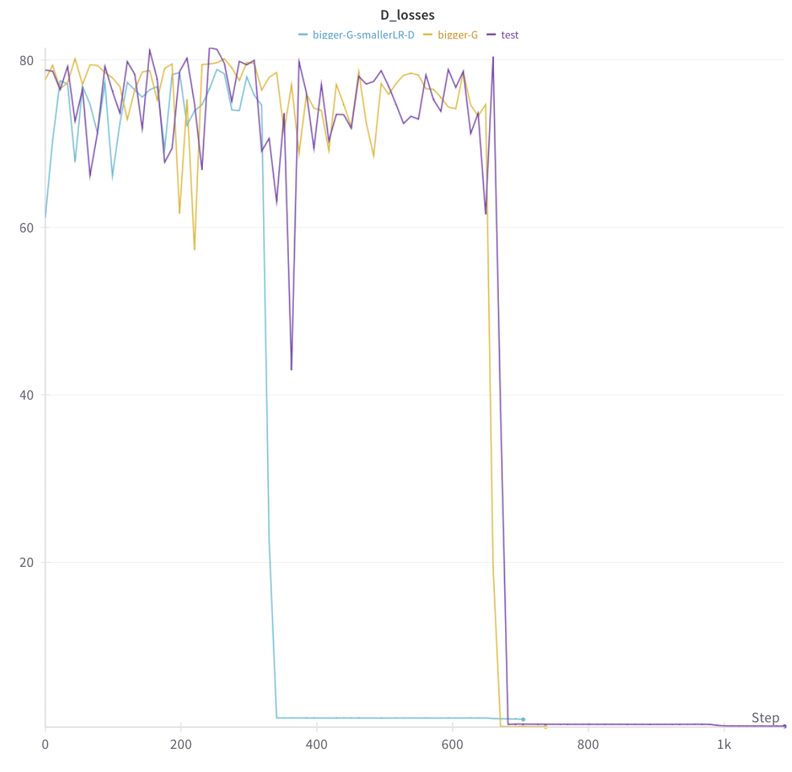

# CGAN

Flexible implementation of Conditional GAN based on the original paper (https://arxiv.org/pdf/1411.1784) and tricks from ganhacks (https://github.com/soumith/ganhacks)

During experiments fully-connected architecture struggles from mode collapse and quicker learning Discriminator which is demonstrated on these graphs of average Discriminator outputs on fake images and Discriminator's loss:

Typical geenration examples depending on a given label:

